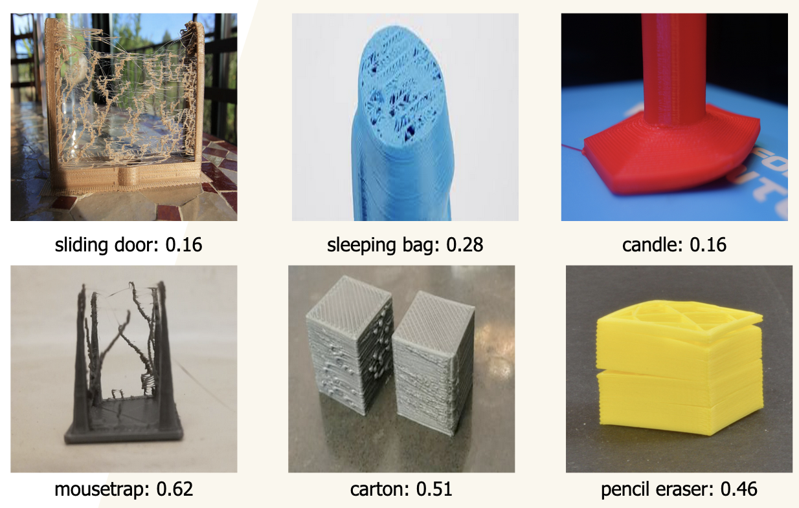

# Printerr

The repo contains a generic image scraper for sourcing and filtering images scraped from google images to create a computer vision dataset. In this repository we focus specifically on collecting images for detecting 3D printing errors.

## Results

Resnet18 pretrained on ImageNet with no finetuning on our data

Resnet18 pretrained on ImageNet *with* finetuning on our data

## Usage instructions

- `scraper.py` defines a class for scraping google images based on user specified search terms. These terms should be provided in `terms.txt` with one search term per line (spaces allowed) and no new line at the end of the file. When run, this file will collect a specified number of images for each term in `terms.txt` and create a text file called `track.txt` that contains a python dictionary with search terms as keys and a list of image urls for each search term as values. The scraper can be run by adding terms to the text file and running `python scraper.py`. The repo assumes the use of python3 and additional dependencies may be needed ( `requirements.txt` and command line options for ease of use are WIP)
- `utils.py` provides functionality to asynchronously download the images at each url specified in the `runs` directory. This directory should contain at least 1 file containing the contents described in `track.txt` above. The `collectUrls()` function will aggregate all urls in the `runs` directory while keeping track of search terms. The downloaded images are saved as `.png` files in the `imgs` folder of the repo, with a separate folder for each search term.
- `viewer.py` provides a basic tkinter application to view the images of a specified directory and label them according to quality for a dataset. The app can be run with `python viewer.py`. Currently, the left and right arrow keys are used to scroll between images, along with the following controls for organizing the images:
  - `p` for pass - use the image as is
  - `e` for edit- the image has to be edited before it can be used in the dataset
  - `t` for trash - the image is not fit for the dataset
  - `esc` - will save and quit the application and will write a `.json` file to the `log` directory named after the directory of images shown in the viewer
    - modifications to the controls including command line options are WIP

## Requirements

Assumes Python 3. See `requirements.txt` for dependencies.

## Disclaimer

*The authors of this repository do not claim any rights whatsoever to any images or other form of media obtained through use of this code and/or any of its functionality, including any images displayed in this repository. Any and all artifacts collected using this tool are subject to the original rights of each respective owner. Images collected from this tool are intended exclusively for educational and non-commercial purposes.*

